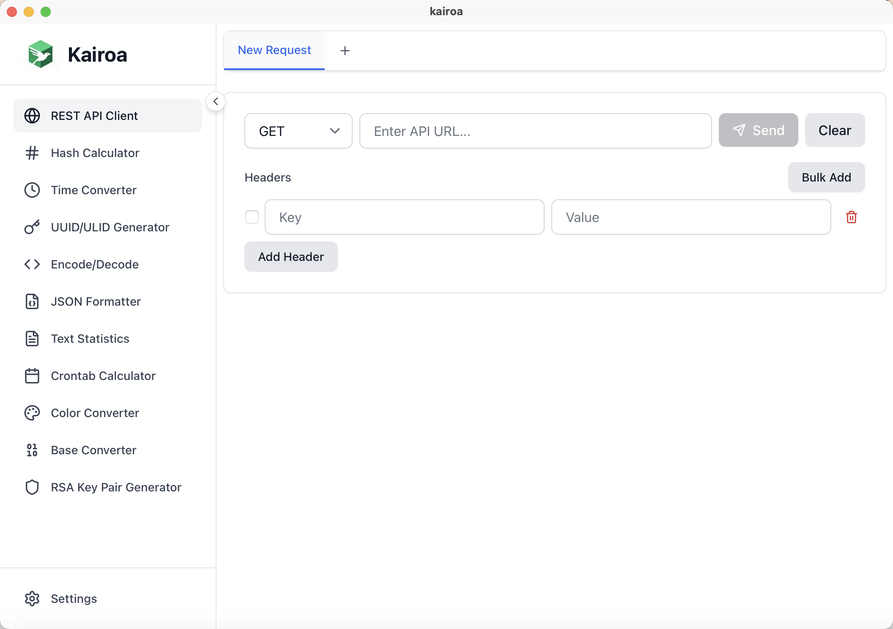

<p align="center">
  <a href="https://github.com/covoyage/kairoa">
    
  </a>
</p>

<h1 align="center">
  Kairoa ➟ Developer Toolbox
</h1>

<p align="center">
    A modern, cross-platform desktop utility application for developers.
</p>

<div align="left">

**English | [简体中文](./README_zh.md)**

</div>

<p align="center">
  
</p>

## Features

### 🔐 Hash Calculator
- Calculate hash values for text and files
- Support for multiple algorithms: MD5, SHA-1, SHA-256, SHA-384, SHA-512
- Drag-and-drop file support
- Copy hash values with visual feedback

### ⏰ Time Converter
- Convert between timestamps and dates
- Support for timezone selection (IANA timezone list)
- Searchable timezone dropdown
- Display results in multiple formats (YYYY-MM-DD HH:mm:ss and ISO format)
- Quick access to current time

### 🔑 UUID Generator
- Generate single or multiple UUIDs
- Option to include/exclude hyphens
- Copy individual UUIDs or copy all at once
- Configurable count

### 📝 JSON Formatter
- Format and minify JSON
- Syntax highlighting for formatted JSON
- Real-time validation
- Copy formatted JSON to clipboard

### ⚙️ Config Converter
- Convert between multiple configuration file formats: JSON, YAML, TOML, INI, XML, Properties, ENV, TOON
- Real-time conversion and format validation
- Automatic conversion history saving
- Bidirectional conversion support for project migration and configuration unification

### 🔧 Encode/Decode
- **Base64**: Encode/decode text and images
- **URL**: Encode/decode URL strings
- **Image/Base64**: Convert images to/from Base64 format
- Image preview and download support
- Side-by-side input/output layout

### 🌐 REST API Client
- Send HTTP requests with multiple methods (GET, POST, PUT, DELETE, PATCH, HEAD, OPTIONS)
- Custom request headers
- Multiple body types: JSON, Text, XML, Form Data, URL Encoded
- Multi-tab support for managing multiple requests
- Response display: status code, headers, body, and response time
- **cURL Import/Export**: Import requests from cURL commands or export requests as cURL commands
  - Automatically detects body parameters (`-d`, `--data`, `--data-raw`, `--data-binary`, `--data-urlencode`, `-F`, `--form`) and sets POST method when no explicit method is specified (following cURL best practices)
  - Formatted cURL command output for easy readability
  - Proper shell string escaping for correct command execution

### 🔌 WebSocket Tester
- Support for WebSocket (ws://) and secure WebSocket (wss://) connections
- Real-time message sending and receiving
- Message history recording and viewing
- Connection status monitoring
- Support for custom message formats
- Convenient for developing and debugging real-time applications and monitoring systems

### 🐳 Docker Commands Generator
- Visually generate common Docker commands
- Container management: run, stop, delete, view logs, etc.
- Image operations: build, pull, push, delete, etc.
- Network and volume management
- Support for custom parameters and options
- No need to memorize complex command parameters, generate accurate commands through interface operations

### 📦 Git Commands Generator
- Quickly generate common Git commands
- Commit management: add, commit, push, pull, etc.
- Branch operations: create, switch, merge, delete, etc.
- Remote repository management
- History viewing and rollback
- Especially suitable for Git beginners and scenarios requiring quick generation of complex commands

### 📊 Text Statistics
- Character count (with/without spaces)
- Word count (supports both English and Chinese)
- Line and paragraph count
- Character type analysis: Chinese characters, English characters, numbers, punctuation

### 📅 Crontab Parser
- Parse and validate cron expressions
- Generate human-readable descriptions
- Display next execution times

### 📄 PDF Signature Checker
- Inspect PDF digital signatures locally
- Validate CMS (PKCS#7) detached signatures
- Display signer metadata, byte ranges, and certificate fields

### 🔒 TLS Version Checker
- Check which TLS/SSL versions are supported by remote servers
- Test TLS 1.0, 1.1, 1.2, and 1.3 support
- Display certificate information
- Identify preferred TLS version

### 📡 Port Scanner
- Scan TCP ports on any remote host with custom ranges
- Adjustable timeout and concurrency controls for faster scans
- Quick presets for top/common ports
- Displays open ports with response latency

### 🌍 IP/Domain Lookup
- Query IP address geographic location and ISP information
- Domain resolution and reverse lookup
- Network details display
- Support for batch queries
- Convenient for network diagnosis, security analysis, and geographic location positioning

### 🔍 DNS Lookup
- Query DNS records (A, AAAA, CNAME, MX, TXT, NS, SOA, SRV) for domains
- Support for DNS over HTTPS (DoH) using Cloudflare DNS
- Select multiple record types to query simultaneously
- Display TTL and record data in organized tables
- Quick selection buttons for common record types
- Useful for DNS troubleshooting, domain configuration, and network analysis

### 📋 HTTP Status Code Lookup
- Query HTTP status codes with detailed descriptions and RFC references
- Search by status code number or name/description
- Display common status codes by default for quick reference
- Support for all standard HTTP status codes (1xx-5xx)
- Category classification: Informational, Success, Redirection, Client Error, Server Error
- Copy status codes with one click
- Useful for API development, debugging, and learning HTTP protocols

### 📄 MIME Type Lookup
- Query MIME types by file extension or MIME type string
- Comprehensive database of MIME types including modern formats
- Search by extension (e.g., pdf, jpg) or MIME type (e.g., application/pdf)
- Display associated file extensions and descriptions
- Useful for web development, file handling, and content-type configuration

### 🔍 User-Agent Parser
- Parse and analyze User-Agent strings to extract browser, OS, and device information
- Display browser name, version, rendering engine
- Show operating system and device type
- Common User-Agent examples for quick testing
- Use current browser's User-Agent with one click
- Helpful for web development, analytics, and compatibility testing

### 🔑 Environment Variables Manager
- Manage environment variables with import/export support
- Add, edit, and delete environment variables
- Import from .env format text
- Export to .env format
- Copy all variables at once
- Local storage persistence
- Useful for development environment configuration and testing

### 🎨 Color Converter
- Convert between color formats: HEX, RGB, HSL, HWB, LCH, CMYK, color names
- Color picker with real-time preview
- Bidirectional conversion between any supported format
- All formats can be edited and converted in real-time

### 🔒 Password Strength Checker
- Real-time password strength assessment
- Multiple security checks: length, uppercase, lowercase, numbers, special characters, character variety
- Common password detection
- Sequential and repeated character detection
- Estimated crack time calculation
- Improvement suggestions for weak passwords

### 🔐 Password Vault
- Secure local password manager with AES encryption
- Master password protection for all stored passwords
- Add, edit, and delete password entries
- Organize passwords by categories (general, work, personal, finance, social, development)
- Search and filter passwords by title, username, or URL
- Show/hide password visibility toggle
- Import and export encrypted password files
- Copy passwords with one click
- All data encrypted and stored locally, never shared or uploaded
- Reset vault option to clear all data

### 📜 Certificate Viewer
- View and inspect certificate files (PEM, CRT, CER, KEY, CERT, DER, P12, PFX)
- Display certificate details: subject, issuer, validity, serial number, algorithm, key size
- SHA-256 fingerprint calculation
- Certificate validity status (valid/expired/not yet valid)
- Extension information display
- File drag-and-drop support
- All processing done offline

### 🔢 Base Converter
- Convert between number bases: Binary (2), Octal (8), Decimal (10), Hexadecimal (16)
- Automatic prefix detection and removal (0b, 0o, 0x)
- Bidirectional conversion with validation

### 🔐 RSA Key Generator
- Generate RSA key pairs (public/private keys)
- Support for multiple key sizes: 1024, 2048, 3072, 4096 bits
- Export in PEM or DER format
- Copy keys to clipboard

## Interface

- 🌓 **Light/Dark Theme**: Switch between light and dark modes (6 themes available)
- 🌍 **Internationalization**: Support for English and Chinese
- 🎨 **Modern UI**: Built with Tailwind CSS
- 📱 **Responsive Design**: Clean and intuitive interface

## Tech Stack

- **Frontend**: SvelteKit 5, TypeScript, Tailwind CSS
- **Desktop**: Tauri 2
- **Icons**: Lucide Svelte
- **Cryptography**: crypto-js

## Prerequisites

- Node.js 18+ and npm
- Rust (latest stable version)
- System dependencies for Tauri:
  - **macOS**: Xcode Command Line Tools
  - **Linux**: System dependencies (see [Tauri documentation](https://tauri.app/v1/guides/getting-started/prerequisites))
  - **Windows**: Microsoft Visual Studio C++ Build Tools

## Installation

This project runs a GitHub CI to build binaries for all platforms. Head to [Releases](https://github.com/covoyage/kairoa/releases) and download the binary as per your requirements.

### macOS

Since the macOS binary is not code-signed with an Apple Developer certificate, you may need to remove the quarantine attribute before running the application:

```bash
xattr -r -c /Applications/kairoa.app
```

This command removes the extended attributes that macOS applies to downloaded applications, allowing you to run the app without Gatekeeper warnings.

### Linux

The application automatically handles common display issues on Linux systems. If you still encounter a white screen, it may be due to insufficient permissions for accessing graphics devices.

**Automatic Solution:**

The application automatically sets `WEBKIT_DISABLE_DMABUF_RENDERER=1` on startup to resolve compatibility issues with NVIDIA GPUs and WebKit2GTK. If hardware acceleration fails, it will automatically fall back to software rendering.

**Manual Solution (if automatic handling doesn't work):**

If you still experience issues, you can manually add your user to the `video` and `render` groups:

```bash
sudo usermod -a -G video,render $USER
```

After adding your user to these groups, you need to log out and log back in (or restart your system) for the changes to take effect.

**Alternative solution:**

You can also run the application with software rendering explicitly enabled:

```bash
LIBGL_ALWAYS_SOFTWARE=1 ./kairoa
```

**Note:** Software rendering may have performance implications but should resolve display issues.

## development

1. Clone the repository:
```bash
git clone https://github.com/covoyage/kairoa.git
cd kairoa
```

2. Install dependencies:
```bash
npm install
```

3. Run the development server:
```bash
npm run tauri dev
```

## Contributing

Contributions are welcome! Please feel free to submit a Pull Request.

### Development Guidelines

1. Fork the repository
2. Create a feature branch (`git checkout -b feature/AmazingFeature`)
3. Commit your changes (`git commit -m 'Add some AmazingFeature'`)
4. Push to the branch (`git push origin feature/AmazingFeature`)
5. Open a Pull Request

### Code Style

- Follow TypeScript best practices
- Use Svelte 5 runes (`$state`, `$derived`, `$effect`)
- Follow the existing code style and formatting
- Add comments for complex logic

## License

AGPL-3.0 License - see the [LICENSE](LICENSE) file for details.

## Support

If you encounter any issues or have questions, please open an issue on GitHub.

---

Made with ❤️ using Tauri + SvelteKit

