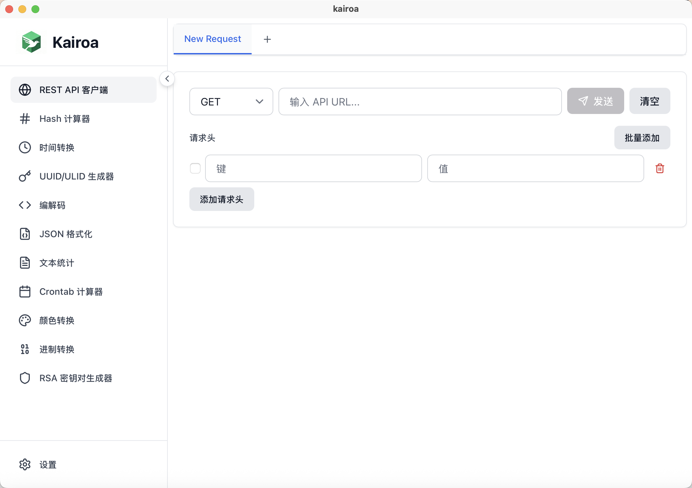

<p align="center">
  <a href="https://github.com/covoyage/kairoa">
    
  </a>
</p>

<h1 align="center">
  💫 Kairoa ➟ 开发者工具箱 💫
</h1>

<p align="center">
    为开发者打造的现代跨平台桌面版开发工具。
</p>

<div align="left">

**简体中文 | [English](./README.md)**

</div>

<p align="center">
  
</p>

## 功能特性

### 🔐 Hash 计算器
- 计算文本和文件的哈希值
- 支持多种算法：MD5、SHA-1、SHA-256、SHA-384、SHA-512
- 支持拖拽文件
- 复制哈希值并显示视觉反馈

### ⏰ 时间转换器
- 时间戳和日期互转
- 支持时区选择（IANA 时区列表）
- 可搜索的时区下拉菜单
- 多种格式显示结果（YYYY-MM-DD HH:mm:ss 和 ISO 格式）
- 快速获取当前时间

### 🔑 UUID 生成器
- 生成单个或多个 UUID
- 可选择是否包含连字符
- 复制单个 UUID 或一键复制全部
- 可配置生成数量

### 📝 JSON 格式化器
- 格式化和压缩 JSON
- 格式化后的 JSON 语法高亮显示
- 实时验证
- 复制格式化后的 JSON 到剪贴板

### 🔧 编解码工具
- **Base64**: 文本和图片的编码/解码
- **URL**: URL 字符串的编码/解码
- **图片/Base64**: 图片与 Base64 格式互转
- 图片预览和下载支持
- 并排输入/输出布局

### 🌐 REST API 客户端
- 支持多种 HTTP 方法（GET、POST、PUT、DELETE、PATCH、HEAD、OPTIONS）
- 自定义请求头
- 多种请求体类型：JSON、Text、XML、Form Data、URL Encoded
- 多标签页支持，可同时管理多个请求
- 响应显示：状态码、响应头、响应体、响应时间
- **cURL 导入/导出**：从 cURL 命令导入请求配置，或将请求导出为 cURL 命令
  - 自动检测 body 参数（`-d`、`--data`、`--data-raw`、`--data-binary`、`--data-urlencode`、`-F`、`--form`），未明确指定方法时自动设置为 POST（遵循 cURL 最佳实践）
  - 格式化的 cURL 命令输出，便于阅读
  - 正确的 shell 字符串转义，确保命令可正确执行

### 📊 文本统计
- 字符数统计（含/不含空格）
- 单词数统计（支持英文和中文）
- 行数、段落数统计
- 字符类型分析：中文字符、英文字符、数字、标点符号

### 📅 Cron 表达式解析器
- 解析和验证 cron 表达式
- 生成人类可读的描述
- 显示下次执行时间

### 📄 PDF 签名校验
- 本地检查 PDF 数字签名
- 校验 CMS (PKCS#7) 分离式签名
- 显示签名者、ByteRange 与证书信息

### 🔒 TLS 版本检测
- 检测远程服务器支持的 TLS/SSL 版本
- 测试 TLS 1.0、1.1、1.2 和 1.3 支持情况
- 显示证书信息
- 识别首选 TLS 版本

### 📡 端口扫描
- 扫描远程主机的 TCP 端口并显示开放情况
- 可配置扫描范围、超时时间与最大并发
- 内置常用端口范围快捷按钮
- 展示开放端口及延迟信息

### 🎨 颜色格式转换
- 多种颜色格式转换：HEX、RGB、RGBA、HSL、HSLA
- 颜色预览
- 支持任意格式间的双向转换

### 🔢 进制转换器
- 支持多种进制转换：二进制（2）、八进制（8）、十进制（10）、十六进制（16）
- 自动识别和移除前缀（0b、0o、0x）
- 双向转换，带输入验证

### 🔐 RSA 密钥生成器
- 生成 RSA 密钥对（公钥/私钥）
- 支持多种密钥长度：1024、2048、3072、4096 位
- 支持 PEM 或 DER 格式导出
- 一键复制密钥到剪贴板

## 界面特性

- 🌓 **浅色/深色主题**: 支持浅色和深色模式切换
- 🌍 **国际化**: 支持英文和中文
- 🎨 **现代化 UI**: 使用 Tailwind CSS 构建
- 📱 **响应式设计**: 简洁直观的界面

## 技术栈

- **前端**: SvelteKit 5、TypeScript、Tailwind CSS
- **桌面端**: Tauri 2
- **图标**: Lucide Svelte
- **加密**: crypto-js

## 开发环境要求

- Node.js 18+ 和 npm
- Rust（最新稳定版）
- Tauri 的系统依赖：
  - **macOS**: Xcode Command Line Tools
  - **Linux**: 系统依赖（参见 [Tauri 文档](https://tauri.app/v1/guides/getting-started/prerequisites)）
  - **Windows**: Microsoft Visual Studio C++ Build Tools

## 安装

本项目使用 GitHub CI 构建所有平台的二进制文件。请前往 [Releases](https://github.com/covoyage/kairoa/releases) 页面下载对应平台的二进制文件。

### macOS

由于 macOS 二进制文件未使用 Apple Developer 证书进行代码签名，您可能需要先移除隔离属性才能运行应用：

```bash
xattr -r -c /Applications/kairoa.app
```

此命令会移除 macOS 为下载的应用添加的扩展属性，允许您在没有 Gatekeeper 警告的情况下运行应用。

## 开发

1. 克隆仓库：
```bash
git clone https://github.com/covoyage/kairoa.git
cd kairoa
```

2. 安装依赖：
```bash
npm install
```

3. 运行：
```bash
npm run tauri dev
```

## 贡献

欢迎贡献！请随时提交 Pull Request。

### 开发指南

1. Fork 仓库
2. 创建功能分支 (`git checkout -b feature/AmazingFeature`)
3. 提交更改 (`git commit -m 'Add some AmazingFeature'`)
4. 推送到分支 (`git push origin feature/AmazingFeature`)
5. 打开 Pull Request

### 代码规范

- 遵循 TypeScript 最佳实践
- 使用 Svelte 5 runes（`$state`、`$derived`、`$effect`）
- 遵循现有的代码风格和格式
- 为复杂逻辑添加注释

## 许可证

AGPL-3.0 License - 详情请参阅 [LICENSE](LICENSE) 文件。

## 致谢

- 使用 [Tauri](https://tauri.app/) 构建
- UI 使用 [SvelteKit](https://kit.svelte.dev/) 构建
- 图标来自 [Lucide](https://lucide.dev/)
- 样式使用 [Tailwind CSS](https://tailwindcss.com/)

## 支持

如果您遇到任何问题或有疑问，请在 GitHub 上提交 issue。

---

使用 ❤️ 和 Tauri + SvelteKit 制作


